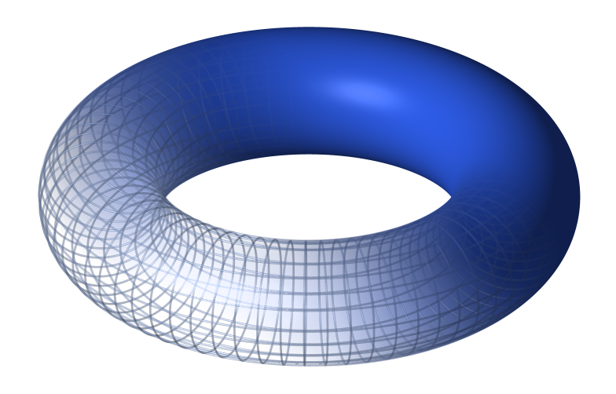
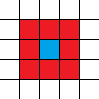
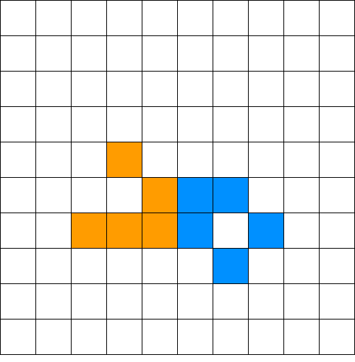
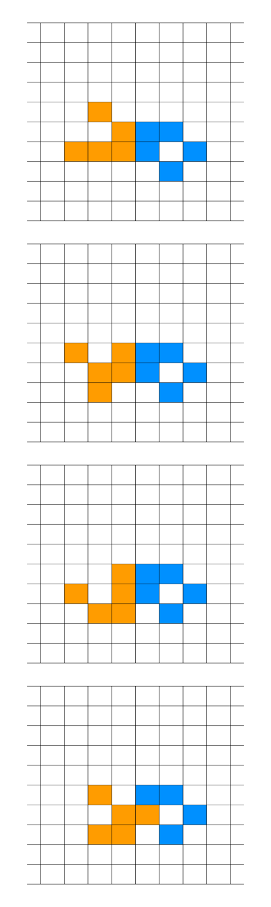
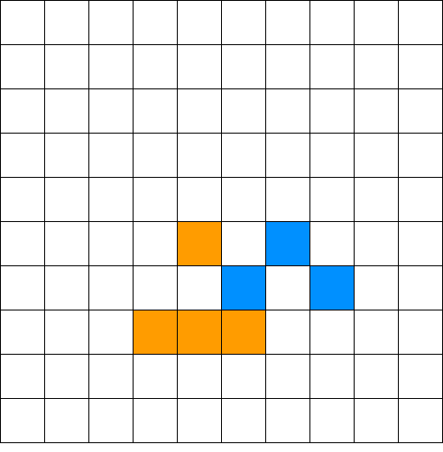
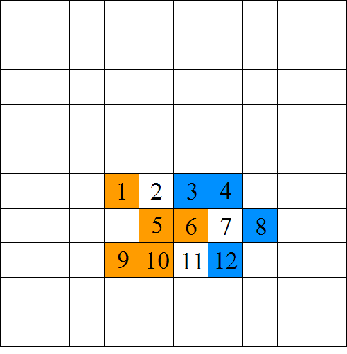
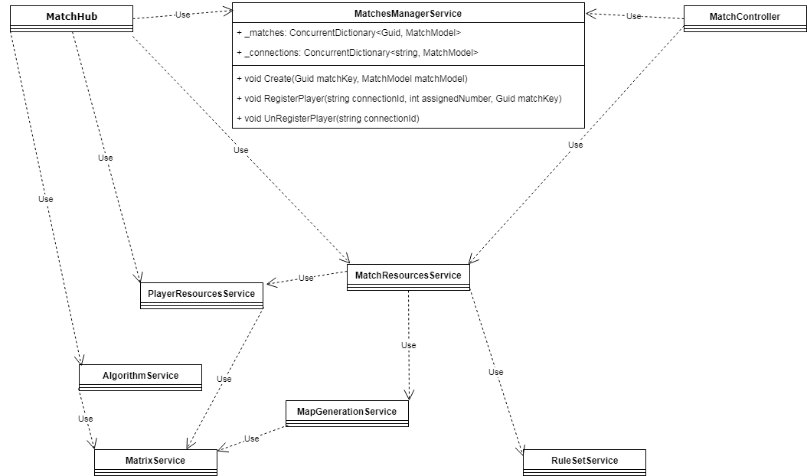
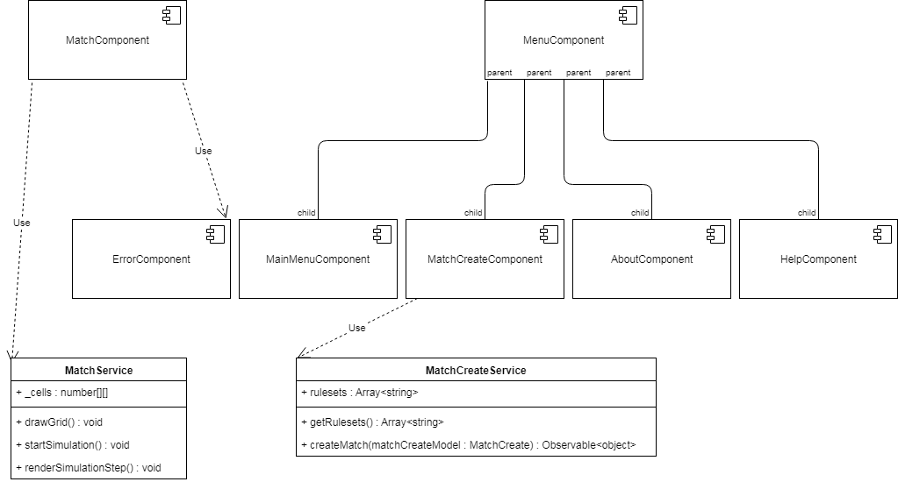

\newpage
\tableofcontents
\newpage

# Introduction

#### Main Idea

This application is targeted towards users that want to learn more about cellular automata (CA)
or that already have an interest in this domain, 
offering them the opportunity to discover 
new types of cellular automata and new rules while also having fun and interacting with friends.

#### Motivation

My main inspiration for this project was my interest in cellular automata. 
I wanted to do something innovative with it,
something that would appeal to anyone, from CA enthusiast to people without a technical knowledge background.

As such, a browser-based multiplayer game was the ideal solution.
Furthermore, it was a new technological challenge for me as I never
used websockets-based frameworks until now and never did a multiplayer game before, 
so I took it as my chance to try it, learn something new,
and have fun with it.


#### Methodology

Server-Client architecture using websockets for live match events and REST api for request-response type of tasks (like match creation).

#### Summary of Solution

The matches will be created by a single user.
This user can share the link to the match with anyone, and after enough users entered the match, the first game can start.
The idea of each game is to win by having the most live cells on the board by the end of the last generation.

# Contributions

Most CA simulators have an 'old' look to them accompanied by an even 'older' looking page design,
and none of them can be experienced between multiple people.
My app does exactly the opposite while offering a fun experience to the user.

My contributions are:

* reframing of an old concept, that of cellular automata.
* pleasant and modern front-end design.
* modern user interface mechanics (transparent menus, background animation, overlayed modals).
* an architecture that can be easily expanded upon, both on front-end and on back-end.
* designing the app with performance in mind (e.g.: the matches are in RAM memory for faster memory access).
* intuitive and easily extendable persistence (using relational database instead of a NoSql one for more flexibility in the future).
* intuitive and 'to-the-point' game design.
* supporting a community of enthusiasts.

I decided that this documentation would be best separated in 5 chapters:

* App Flow - this chapter summarises the functionalities found in the menus and general mechanic behind starting to play.

* CA theory in CA Wars - this chapter briefly explains the theory behind cellular automata, the rules used in CA Wars and most of all, the 
particularities of the app in the context of CA theory.

* Game Flow - this chapter thoroughly explains the flow of a single game using relevant examples. Reading this chapter will probably 
make the best job in painting the big picture of the app.

* User Iterface - this chapter throughly explains the bonus functionalities the user can access during playing that make the game more 
customizable, easy to play, and fun.

* Architecture - this chapter summarises the front-end and back-end achitectures, also explaining why certain strategies were chosen instead of
others.


# Chapter I - App Flow

The app will welcome the user through a main menu after which the user can opt for:

* creating a new multiplayer match.
* learn how the game works and what each option does.
* find about the author through an 'About' section.

When creating a new multiplayer match, the user will be able to customize the following settings:

* Number of players.
* CA rule set which will determine the evolution of each game of the match.
* Maximum number of generations resulted from the CA evolution.
* Number of rows of the play field.
* Number of columns of the play field.

After match creation, the user will receive an url from the server, which he will use to share the match with his/her friends.
Then, the match will begin. A match is a succession of games, each game ending in a win or a draw between more players.


# Chapter II - CA theory in CA Wars

In this chapter, we will look into the basic theory of CA and how it relates to the flow of a game.

## 2.1 Basic CA

A cellular automaton consists of a regular grid of cells, each cell being in one of a finite number of states, such as 'on' and 'off'. 
The grid can be in any finite number of dimensions. 
For each cell, a set of cells called its neighborhood is defined relative to the specified cell. 
An initial state (time t = 0) is selected by assigning a state for each cell of the grid.
A new generation is created (advancing t by 1), according to some fixed rule that determines the new state of each cell in terms of the current state of the cell and the states of the cells in its neighborhood. 
Typically, the rule for updating the state of cells is the same for each cell and does not change over time, and is applied to the whole grid simultaneously.

## 2.2 CA in the game

For CA Wars, only 2-dimensional CA are used, so the generations will evolve on a 2-dimensional grid.

Cellular automata are often simulated on a finite grid rather than an infinite one. 
In two dimensions, the universe would be a rectangle instead of an infinite plane. 
The obvious problem with finite grids is how to handle the cells on the edges.

CA Wars uses finite grids. 
Finite grids were chosen to make the games more competitive by shifting the focus from 'expanding' to 'attacking' and 'defending'.
Another great reason is performance (easier to compute on a finite grid).

In CA Wars, 'edge' cells are handled with a 'toroidal' arrangement: 
when one goes off the top, one comes in at the corresponding position on the bottom, and when one goes off the left, one comes in on the right.


This can be visualized as taping the left and right edges of the rectangle to form a tube, 
then taping the top and bottom edges of the tube to form a torus (doughnut shape).

{width=100px}

The reason for using this 'toroidal' arrangement is ease of programming (using modular arithmetic functions).

The rules used in CA Wars are called 'Life-like' rules.

To understand what 'Life-like' rules refer to, we will have to analyze the most renown CA rule:

### 2.2.1 Game of Life

The universe of the Game of Life is a 2-dimensional grid of square cells, 
each of which is in one of two possible states, 'alive' or 'dead', (or populated and unpopulated, respectively). 
Every cell interacts with its eight neighbours, which are the cells that are horizontally, vertically, or diagonally adjacent.
This is called the 'Moore neighbourhood'.

{width=100px}

At each step in time, the following transitions occur:

1. Any live cell with fewer than two live neighbors dies, as if caused by under population.
2. Any live cell with two or three live neighbors lives on to the next generation.
3. Any live cell with more than three live neighbors dies, as if by overpopulation.
4. Any dead cell with exactly three live neighbors becomes a live cell, as if by reproduction.

The first generation is created by applying the above rules simultaneously to every cell in the seed; 
births and deaths occur simultaneously, and the discrete moment at which this happens is sometimes called a tick. 
Each generation is a pure function of the preceding one. 
The rules continue to be applied repeatedly to create further generations.

### 2.2.2 Life-like CA

A CA is 'Life-like' (in the sense of being similar to Conway's Game of Life) if it meets the following criteria:

* The array of cells of the automaton has two dimensions.
* Each cell of the automaton has two states, 'alive' and 'dead'.
* The neighborhood of each cell is the Moore neighborhood.
* In each time step of the automaton, the new state of a cell can be expressed as a 
function of the number of adjacent cells that are in the alive state and of the cell's own state; 
that is, the rule is outer totalistic (sometimes called semitotalistic).

This class of cellular automata is named for the Game of Life, the most famous rule, which meets all of these criteria. 
Many different terms are used to describe this class. 
It is common to refer to it as the "Life family" or to simply use phrases like "similar to Life".

There are three standard notations for describing these rules.
In the notation we will be using, Game of Life can be expressed like this: 'S23/B3'.
S stands for 'survival' and 'B' stands for 'birth'.
'S23/B3' would thus be read as "The cell will survive if it has exactly 2 or 3 live neghbours/ The cell will become alive if it has exactly 3 live neghbours".

There are 2^18^ = 262,144 possible Life-like rules, only a small fraction of which have been studied in detail.

### 2.2.3 Mirek's Cellebration (MCell)

Mirek's Cellebration (MCell) is a 32-bit Windows program whose main purpose is exploring existing and creating new rules and patterns of 1-D and 2-D Cellular Automata.

CA Wars uses all the MCell built-in Life-like rules:

Name          | Rule(S/B)     | Character    
------------- | ------------- | -------------
2x2	          | 125/36        |	Chaotic	     
34 Life	      | 34/34         |	Exploding
Amoeba	      | 1358/357	    | Chaotic
Assimilation	| 4567/345	    | Stable
Coagulations	| 235678/378	  | Exploding
Conway's Life	| 23/3	        | Chaotic
Coral	        | 45678/3	      | Exploding
Day & Night	  | 34678/3678	  | Stable
Diamoeba	    | 5678/35678	  | Chaotic
Flakes	      | 012345678/3	  | Expanding
Gnarl	        | 1/1      	    | Exploding
HighLife	    | 23/36	        | Chaotic
Long life    	| 5/345	        | Stable
Maze	        | 12345/3	      | Exploding
Mazectric	    | 1234/3	      | Exploding
Move	        | 245/368	      | Stable
Pseudo life	  | 238/357	      | Chaotic
Replicator	  | 1357/1357	    | Exploding
Seeds (2)	    | /2	          | Exploding
Serviettes	  | /234	        | Exploding
Stains	      | 235678/3678	  | Stable
WalledCities	| 2345/45678	  | Stable

# Chapter III - Game Flow

* Step 1: Map Generation

A simple 2-dimensional orthogonal grid of minimum size 4x4 and maximum size 50x50, that is partitioned such as each player would get the same amount of territory.

{width=100px}

The strategy for map generation is randomly selecting, for each cell, which player can 'own' it. Given the uniform distribution of number of 'viable' cells per player, 
we can be sure of the fact that each player will get approximately the same amount of 'territory'.

Another plus of using this method is the fact that there are very low chances for a player to get a large clump of 'territory' thus meaning that the player is
constrained to using patterns that don't require a lot of cells, meaning he can more easily predict a game and employ a certain strategy. 

* Step 2: Initial Configurations

Each player will activate cells as to create the most favorable initial configuration for himself.

* Step 3: Automata Evolution

We will now analyze a simplified case of automata evolution that can happen during a game:

We will start from the following initial configuration:

{width=100px}

Here, player I has the orange cells and player II the blue ones.

The CA we will be using is Game of Life (GOF).

GOF consists of the following transitions:  

1. Any live cell with fewer than two live neighbors dies, as if caused by under population.
2. Any live cell with two or three live neighbors lives on to the next generation.
3. Any live cell with more than three live neighbors dies, as if by overpopulation.
4. Any dead cell with exactly three live neighbors becomes a live cell, as if by reproduction.

We can see in the picture that player I has a “Glider”, a pattern of GOF under the category: “spaceship” (for the way it “moves”). 
Player II has a “Boat”, also called a “still life”.

The initial configuration evolves as follows:

{width=100px}

\newpage

The last panel shows how a cell can overwrite an opponent cell.

At each iteration of the evolution, the transitions for a player are calculated as if the opponent’s cells are all dead.
The only problem here would be the case when a cell wants to be activated with orange and blue at the same time. In this case the cell will remain dead.

Getting back to the evolution, the next state is:

{width=100px}

To analyze how we arrived at this state we will use this:

{width=300px}


Cell 1: died because of transition 1  
Cell 2: was born because of transition 4; neighbors: {1,5,6}  
Cell 3: died because of transition 1  
Cell 4: lived because of transition 2  
Cell 5: died because of transition 3  
Cell 6: was reborn as a blue cell because of transition 4; neighbors: {3,4,12}  
Cell 7: stayed dead  
Cell 8: lived because of transition 2  
Cell 9: lived because of transition 2  
Cell 10: lived because of transition 2  
Cell 11: was born because of transition 4; neighbors: {5,6,10}  
Cell 12: died because of transition 1  

\newpage

The next state is:

{width=100px}

After this state follows simultaneous death for both players’ cells.

# Chapter IV - User Interface


{width=75px}

The Droplet: When activated, you can erase your 'alive' cells by clicking or dragging on them.


{width=75px}

The Hash: When activated, the black border of the grid will become white thus giving the play view a different look.


{width=75px}

The Exit: When clicked, it opens a confirmation dialogue before exiting.


#### The following buttons appear only after the game has finished and right before resetting the game.


{height=75px}

The Media Buttons: They work exactly like video player buttons but instead of frame they go through CA generations.


{width=75px}

The Save: When clicked, it automatically downloads each CA generation as png in the default download folder of your browser.


{width=75px}

The 'Who-Sent' Dots: Each dot means that the player of that color already sent its initial configuration. 
The order of the dots, from left to right corresponds to the real order in which the players sent their respective initial configurations. 
So in the example above, the 'blue' player sent first, followed by the 'orange' and then the 'green' player.

#### The game view is also dynamic in the sense that you can move the camera around by dragging with right click over the canvas surface or zooming in and out using the mouse scroll.

# Chapter VI - Architecture

## Server-side Architecture

{width=800px}

This is the dependency graph of the server architecture with details about the MatchesManagerService class
that acts like a container class for the state of the server.

Going from top to bottom, we have the two classes that control the traffic of the server, the MatchHub class
that concerns itself with real-time communication and the MatchController class that concerns itself with
request-response type of communication.

The MatchController class was mainly implemented so that the MatchHub wouldn't get overworked and we would have
explicit separation of types of communication for easier extendability and maintainability.

The MatchesManagerService class has two concurrent dictionaries that hold the state of the server, namely:  
* _matches dictionary, that stores the correspondence between a match's matchKey and the match object from RAM memory;
* _connections, that stores the correspondence between a connection id of a user and a match object from RAM memory.

The _connections dictionary's purpose is to more easily get the match a player is in case the player disconnects from the match.

The MatchesManagerService class also has three very important methods:

* Create: Stores a match in _matches dictionary.
* RegisterPlayer: Stores the connection in _connections dictionary and adds the player model to the match model.
* UnRegisterPlayer: Is called when a player disconnects from the match. The method makes sure the information about the player is erased 
so that the match can continue normally.

In the lower half of the diagram we can see all the other services used on the back-end.  

* MatchResourcesService: Creates match models for storing them in the MatchesManagerService

* PlayerResourcesService: Creates player models that will be stored in a match model. This service is also 
responsible with producing personalized maps for each player (for more details, see the "Code Examples" section).

* AlgorithmService: Runs the CA evolution based on the ruleset found in the match model and returns all
a list of generations and the winner (or let's you know a draw happened if that is the case).

* MapGenerationService: Returns the match map. The match map is stored in memory as a grid with each element 
being the assigned number of a player. So if the first cell of the grid has the value '1' that means that 
only player '1' has control over that cell.

* MatrixService: A wrapper for basic matrix operations that should be globally available.

* RuleSetService: A wrapper for the repository that is used to parse the rules stored in the database 
(for more details, see the "Code Examples" section).

## Client-side Architecture

{width=800px}

This is the dependency graph of the client architecture with details about the service classes.

In the upper half of the diagram we have the components and in the lower half we got the services.  

### Parent Components:

* MatchComponent: this component establishes the connection with the MatchHub on the back-end and manages the communication between
the hub and the component. This component delegates its computing tasks to the MatchService.

* MenuComponent: this component establishes a template for all the menus of the app and is the parent for all its child components, meaning that
a child component can't be rendered without first rendering the MenuComponent. 
For a menu like the 'help' menu the url will be 'menu/help' and for 'about' menu the url will be 'menu/about'. In other words, menu is a parent
to those components also from a routing perspective.

### Other Components:

* ErrorComponent: this component is instantiated by the MatchComponent whenever there was an error in connecting to the match.

Possible errors are:  

* The match key isn't a valid Guid.
* The match is full (the match already started).
* The match is non-existent.

#### The remaining components are self-explanatory, in that they correspond to their respective views. For example, the MatchCreateComponent is the match creation menu.

### Services:

* MatchService: as stated above, MatchService is used by the MatchComponent to delegate its computing tasks. 
The service also maintains the state of the grid in the _cells 2d array.  

MatchService functions:

* drawGrid: is used to render the grid. The color of the grid border can be modified through the activation of the "Hash" button (for more details, see the "User Interface" section).
* startSimulation: is used to set a recurring task (recurs at every 60 ms) that renders a new generation of the finished game at every firing.
* renderSimulationStep: is used to set the _cells to the current generation and then call drawGrid to render everything on the game view.

* MatchCreateService: this service is where the MatchCreateComponent gets its rulesets from. MatchCreateService also has the responsability 
of sending the match create model to the back-end for actual creation.

MatchCreateService functions: 

* getRuleSets: this function returns the _rulesets array.
* createMatch: this function makes a http post request with the match create model to the corresponding endpoint in MatchController of the server. 
It also returns an observable that can be used to easily track and manage the response of the server.

## Code Examples

### Back-End Samples

```{r}
public async Task SendConfig(string unparsedMatchKey, float[,] playerConfig, int assignedNumber) {
    var matchKey = Guid.Parse(unparsedMatchKey);
    var match = this._matchesManagerService.GetMatchModel(matchKey);
    var playerId = this._matchesManagerService.FindPlayerId(Context.ConnectionId, match);
    match.InitialConfigs.Add(new InitialConfigModel(playerConfig, playerId));

    await Clients.Group(matchKey.ToString()).SendAsync("PlayerSent", assignedNumber);

    if (match.InitialConfigs.Count == match.Players.Count) {
        var result = this._algorithmService.RunGame(match);

        await Clients.Group(matchKey.ToString()).SendAsync("Game", result);
        match.InitialConfigs.Clear();
    }
}
```

MatchHub SendConfig method:  

This method is invoked remotely by the client-side, which also is responsible with providing all the parameters.

#### The Parameters:

1. unparsedMatchKey: guid converted to string that represents the match key.
2. playerConfig: a 2d uniform array of float elements that represents the initial configuration of the player.

The 2d uniform float array has the following cell values:

* the assigned number of the player, which means that the cell is 'alive'.
* '-1', which means that the cell is 'dead'.
* '-2', which means that the cell is part of enemy territory.  

3. assignedNumber: the number assigned to the player. If the player has the assigned number '2' then we call him player '2'.

#### What it does:

The method registers the initial configuration that the player sent with the correspoding match (extracted using the match key) and 
notifies all the players in that match which player sent his/her initial configuration.

If the number of initial configurations is equal to the number of all the players currently in the match, so, if all
players connected to the match sent their initial configurations, then the algorithm service is used to compute all the generations of 
the game, until the number o generations reaches the maximum iterations number (or until all cells are dead). At the end,
Each player receives the results and the initial configurations are erased from memory.

```{r}
public float[,] GetPersonalizedMap(float[,] map, int assignedNumber) {
    var pmap = this._matrixService.CopyMatrix(map);

    for (int i = 0; i < pmap.GetLength(0); i++)
    {
        for (int j = 0; j < pmap.GetLength(1); j++)
        {
            if(pmap[i,j] == assignedNumber) {
                pmap[i,j] = -1;
            }
            else {
                pmap[i,j] = -2;
            }
        }
    }

    return pmap;
}
```


# Conclusion

The main goal of this thesis was to put cellular automata in a completely new, fresh, perspective that would appeal to anyone.
However, I didn't want it to only seem like a fun idea, but also be a fun idea and experience, so I knew there was a long way to go in terms of
front-end work, which was quite scary for me, given that I wasn't confident of my front-end engineering and design skills.

I also wanted to learn a lot and explore, so I chose to use the latest updates for each major technology in the project, even though I knew I wouldn't find
the most extensive documentation given their recent launches.

At the beginning, it was pretty hard researching and getting used to signalR. I also had to open some issues on the aspnet/signalR github repository to
better understand what this and the older version of singalR  have in common and what is different.

I also had to get used to the front-end canvas and its mouse input event handling 
and had to do a lot of brainstorming to figure out the design on the go, 
because I wanted it to be my own invention, with as little outside help as possible.

However, I think the hardest thing was to make hard architectural choices.
I made some architectural decisions that turned out to be not as succesful as I had hoped and then had to redo the whole thing.
But all those bad decision were great lessons for me and I discovered how much more important was 'planning ahead' than I originally thought.

I also experimented with when to refactor my code and found out it's better to do it early most of the times.

Visual Studio Code offered me the flexibility I needed for both back-end and front-end and its lightness probably saved my calm a few times.

#### Ideas for the future

In the future, the game could accommodate multiple classes of CAs, not only life-like CAs.
However, the greatest addition would be a singleplayer mode in which you can test out new ideas by playing with a single color or more and see how they interact.

#### Personal Opinion

The result of my work until now is an application meeting the basic objectives I was set out to achieve. I also learned a lot from working on this project,
both technical knowledge and organizational wisdom.

When I say 'organizational wisdom' I'm referring to:

* reading as much as you can about the used frameworks before deciding on the architecture. 
* refactoring early (even when you are the only person working on the project).
* realizing the importance of OOP principles.
* discussing your ideas with someone else.

I am also more confident now in my ability to produce good looking and dynamic UI.

All in all, it was a thrilling experience that only made me more passionate and less scared about real-life, big projects.

# Technologies

#### C#

C# is a very versatile programming language, that can be used for game development, web development, and many more.  
It's easier to use than lower-level language like C++ and more flexible than higher-level languages like Python.  
It's also a very popular programming language, ranking 4th in the 2018 Stack Overflow Developer Survey in the "Most Popular Technologies"
after Javascript, Java and Python.

#### .NET Core

.NET Core is a server-side framework that is open-source, cross-platform, lightweight and easy to use.
It can be said it is the "new kid on the block" compared to its predecesor, .NET Framework, and is very appealing
for newcomer programmers given its lightness and well documented features.
It is also the 4th most popular framework in the 2018 Stack Overflow Developer Survey.

#### SignalR

ASP.NET Core SignalR is a library that simplifies adding real-time web functionality to apps. 
Real-time web functionality enables server-side code to push content to clients instantly.

SignalR provides an API for creating server-to-client remote procedure calls (RPC). 
The RPCs call JavaScript functions on clients from server-side .NET Core code.

Naturally, the client-side version of signalR was used in conjuction with the .NET one so that functions
could be registered and thus made visible to the server-side hub 
(A hub is a high-level pipeline that allows your client and server to call methods on each other). 
The client-side version can also make
RPCs to server-side functions, thus making the communication between client-side and server-side very
simple and intuitive.

#### Angular 6

Angular is a framework that makes it easy to build client-side apps.  
Angular combines declarative templates, dependency injection, end to end tooling, and integrated best practices to solve development challenges.  

Angular was the chosen client-side framework because of its following advantages: is trustwhorty, familiar, and has a strong ecosystem.  
Angular is trustworthy because The Angular team is committed to evolving Angular in a careful and planned manner,
with a publicly announced release schedule that allows developers to understand and plan for future changes to the framework.
They roll out new versions pretty frequently so it's pretty obvious the framework is here to stay and evolve.  

Angular is familiar for a developer with C#/.NET background. Both C# and typescript rely on type specification which makes working with them
safer and clearer.

Angular also has a strong ecosystem. There are thousands of libraries and code samples across the web for Angular
and given it has the giant tech company Google as its parent, we know for sure it has enough resources to grow.

#### Automapper

AutoMapper is an object-object mapper.  
Object-object mapping works by transforming an input object of one type into an output object of a different type. 
What makes AutoMapper interesting is that it provides some interesting conventions to take the dirty work out of figuring out how to map type A to type B. 
As long as type B follows AutoMapper’s established convention, almost zero configuration is needed to map two types.

#### Material Design Bootstrap

MD Bootstrap is a very popular desing framework meant to make front-end design easy and intuitive.

# Bibliography

1. https://docs.microsoft.com/en-us/aspnet/core/signalr/?view=aspnetcore-2.1
2. http://psoup.math.wisc.edu/mcell/rullex_life.html
3. https://angular.io/docs
4. http://docs.automapper.org/en/stable/index.html
5. https://css-tricks.com/
6. https://mdbootstrap.com/
7. https://github.com/michaelbazos/angular-feather
8. https://en.wikipedia.org/wiki/Cellular_automaton
9. https://en.wikipedia.org/wiki/Conway%27s_Game_of_Life
10. https://en.wikipedia.org/wiki/Life-like_cellular_automaton
11. http://www.mirekw.com/ca/whatis_mcell.html
12. https://medium.com/angular-japan-user-group/why-developers-and-companies-choose-angular-4c9ba6098e1c
13. https://insights.stackoverflow.com/survey/2018/

